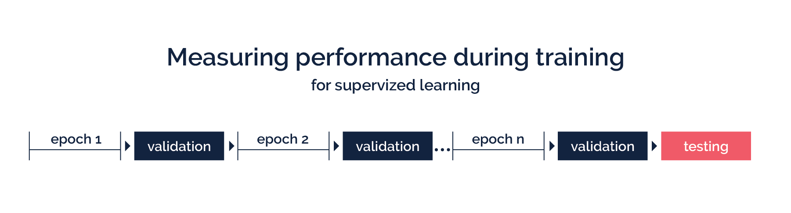

Training overview
============

Most ML models require training in order to handle a specific task. During training, the model will adjust its neurons (or weights) based on the training dataset. After each training loop (or epoch) the weights are updated by a learning rate and an optimization function.

In this tutorial, you will learn the most relevant features for training your model in VergeML.

Starting training
-----------

Training is started by typing:

    ml train

This will start the training process with all default parameters of your chosen model. 

Optimizing the standard training hyperparameters
-----------

The general performance on your training depends on the model itself, its set of hyperparameters and on the underlying training dataset. Hyperparameters are like imaginary knobs that you can turn and adjust, so your models gets better at understanding the specific task. 

You can simply specify hyperparameters in a single training run by including them in your terminal command:

    ml train --learning_rate=0.005 --epochs=50

> Info: Type ml help glossary to see definitions of the most common hyperparameters used for your model.

You can set hyperparameters as new default values in your [configuration file](/Configuration.md), so they will take effect in any training run of your project. 

To do this, open your project file (vergeml.yaml) and, for example, set a new default learning rate and a dropout:

~~~yaml
model: imagenet

train:
  architecture: resnet-50
  learning-rate: 0.002
  dropout: 0.5
  ~~~

> Info: Type ```ml help train``` to see what hyperparameters you can change for your model and what they do.

Training progression
-----------

The command ```ml train``` will trigger the following steps: 

1. Creating a cache file in the .cache directory and fingerprints the input data (VergeML will skip this step, if your data and preprocessing pipeline did not change in between training runs). This step speeds up training a lot! 
2. Loading of the model's architecture.
3. Start training by loading input batches into the model.
4. Writing training results and saving the model´s checkpoints into the training directory.

Your training will finish, when the last epoch is completed.

Compare training runs
-----------

VergeML provides you with performance metrics during training. The most important ones in supervized learning are:
* Accuracy: Tells how well the AI can predict based on the ground truth. Validation and Test accuracy are done through a seperate, never seen dataset.
* Loss: Describes the distance of the prediction to the ground truth. Normally, the lower the better the AI.

> Info: Check out the chapter for [performance metrics](/Training/Performance_metrics.md), if you want to know more about this topic.

After each training epoch VergeML tests the performance with your validation dataset. Your model has never seen the files, so the validation accuracy gives you a running feedback on your training performance. The final test is done with your test dataset.



When training you will notice considerable performance differences between training runs when you change your paramters or training data. The main goal behind training an AI is to get the best results. So to make it easy to compare them, just type: 

    ml list

This will give you an overview of your past training runs with their according performances:

| instance | model | status |training_start | epoch | batch | test_acc | test_loss |
|----|----|----|----|----|----|----|----|
| nervous-tron | inceptionv3 | finished|2018-09-06 19:43|20|64|0.876|0.244|
| enhanced-autobot | inceptionv3 | cancelled|2018-09-06 18:27||64|||
| optimum-neuron | resnet50 | finished|2018-09-06 18:14|20|64|0.914|0.178|

Saving Checkpoints
-----------

VergeML automatically saves the trained AI after each epoch, given that the previous performance was lower. You can delete a trained AI by deleting the complete folder in your training directory.

Next read
============

In the next chapter we will show you what you can do to enhance your data to further improve your training performance. So let´s jump to it: [Configuration](/Training/Configuration.md).

Or jump to the [Table of Content](/TOC.md)